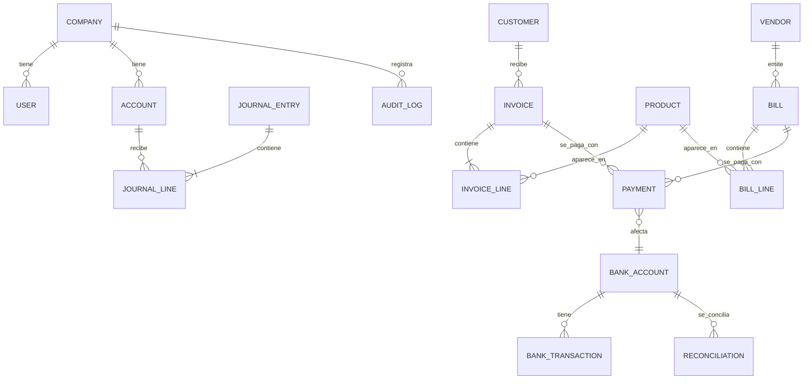

# LedgerLocal - Modelo de datos

> Reemplaza la versión anterior pensada para SQLite vía Tauri/Rust. El motor sigue siendo **SQLite** (gratis, un solo archivo), pero ahora se accede desde el backend Node vía **Prisma**. Ver `ARCHITECTURE.md` para el contexto general.

Este documento describe las entidades principales en términos conceptuales. El `schema.prisma` definitivo vivirá en `server/prisma/schema.prisma` y se generará en una parte posterior del desarrollo.

## Principios

- Partida doble real: toda transacción de negocio (factura, pago, gasto) genera líneas de asiento (`journal_line`) que deben sumar cero.
- Los documentos confirmados (facturas, pagos, asientos) no se editan: se anulan o se revierten con un asiento/documento inverso, manteniendo trazabilidad.
- Todas las tablas operativas llevan `company_id` (ver decisión de multi-empresa en `ARCHITECTURE.md`).
- Montos se almacenan como enteros en la unidad mínima de la moneda (centavos) para evitar errores de punto flotante. SQLite no tiene tipo `DECIMAL` nativo, así que esto es obligatorio, no opcional.
- Fechas en UTC (`DateTime` de Prisma), formateadas en la zona horaria del negocio solo en la capa de presentación.

## Entidades

### Company
Datos del negocio: nombre, identificación fiscal, moneda base, moneda secundaria, período fiscal, dirección, logo.

### User
Usuarios locales de la instalación. `email`, `passwordHash`, `name`, `active`, relación a `Role`.

### Role / Permission
Roles (`admin`, `contable`, `ventas`, extensibles) con permisos por módulo y acción (`view`, `create`, `edit`, `delete`) sobre cada recurso.

### Account (Plan de cuentas)
Catálogo de cuentas contables jerárquico: `code`, `name`, `type` (`asset`, `liability`, `equity`, `income`, `expense`), `parentId`, `isSystem` (cuentas que el sistema necesita y no se pueden borrar), `active`.

### JournalEntry / JournalLine
`JournalEntry`: cabecera del asiento (`date`, `memo`, `status`: `draft`/`posted`/`reversed`, `sourceType`, `sourceId` para trazar de dónde vino — factura, pago, manual).
`JournalLine`: `accountId`, `debit`, `credit` (uno de los dos en cero), `entityType`/`entityId` opcional (cliente/proveedor) para reportes de auxiliares.

Invariante: la suma de `debit` de un `JournalEntry` debe igualar la suma de `credit` antes de poder pasar a `posted`.

### Customer / Vendor
`name`, `taxId` opcional, `email`, `phone`, `address`, `paymentTermsDays`, `currency`, `defaultAccountId` (CxC o CxP asociada), `active`, saldo calculado (no almacenado, derivado de facturas/pagos).

### Product
`sku`, `name`, `type` (`product`/`service`), `unitPrice`, `taxRateId`, `trackInventory` (bool), `stockQuantity` (si aplica), `incomeAccountId`, `expenseAccountId`.

### TaxRate
`name`, `rate` (porcentaje), `accountId` (cuenta de pasivo donde se acumula el impuesto cobrado).

### Invoice / InvoiceLine
`Invoice`: `customerId`, `number` (correlativo por empresa), `issueDate`, `dueDate`, `currency`, `exchangeRate`, `status` (`draft`/`confirmed`/`paid`/`partially_paid`/`void`), `subtotal`, `taxTotal`, `total`, `balanceDue`.
`InvoiceLine`: `productId` opcional, `description`, `quantity`, `unitPrice`, `taxRateId`, `lineTotal`.

Al confirmar una factura se genera un `JournalEntry`: débito a Cuentas por Cobrar, crédito a Ingresos (y crédito a Impuestos por Pagar si aplica).

### Bill / BillLine
Análogo a Invoice pero para proveedores (cuentas por pagar). Al confirmar: débito a Gastos/Inventario, crédito a Cuentas por Pagar.

### Payment
`type` (`customer_payment`/`vendor_payment`), `invoiceId` o `billId`, `amount`, `date`, `method` (`cash`/`bank_transfer`/`card`/`other`), `bankAccountId` opcional.
Genera asiento: para pago de cliente, débito Banco/Caja, crédito CxC; para pago a proveedor, débito CxP, crédito Banco/Caja. Valida que `amount` no exceda el saldo pendiente del documento.

### Expense
Gastos pagados directamente (sin pasar por `Bill`), para compras menores. `accountId` (cuenta de gasto), `amount`, `date`, `paidFrom` (cuenta de banco/caja), `vendorId` opcional.

### BankAccount
`name`, `accountId` (cuenta contable asociada, tipo activo), `currency`, `openingBalance`.

### BankTransaction
Movimientos importados por CSV: `date`, `description`, `amount`, `bankAccountId`, `status` (`pending`/`matched`/`reconciled`/`ignored`), `matchedPaymentId` o `matchedJournalLineId`.

### Reconciliation
`bankAccountId`, `periodStart`, `periodEnd`, `statementEndingBalance`, `status` (`in_progress`/`completed`), lista de `BankTransaction` incluidos y diferencia calculada.

### ExchangeRate
`fromCurrency`, `toCurrency`, `rate`, `date`. Ingreso manual (sin llamadas externas obligatorias, ya que la app debe poder operar sin internet); opcionalmente un botón para traer tasas si hay conexión, sin depender de ello.

### AuditLog
`userId`, `action`, `entityType`, `entityId`, `before` (JSON), `after` (JSON), `timestamp`. Se escribe en cada mutación relevante (confirmar, anular, revertir, restaurar backup, cambios de permisos).

### Backup
Metadatos de respaldos realizados: `filename`, `createdAt`, `sizeBytes`, `createdBy`. El archivo físico es una copia del `.db` de SQLite guardada en `server/backups/`.

## Diagrama ER (alto nivel)

## Convenciones de Prisma/SQLite a tener en cuenta

- Usar `Decimal`-como-entero (campo `Int` representando centavos) en vez de `Float` para todo monto.
- `cuid()` o `uuid()` como `id` por defecto (Prisma lo soporta igual en SQLite).
- Enums de Prisma se simulan en SQLite como `String` con validación en la capa de aplicación (Zod), ya que SQLite no tiene tipo enum nativo — Prisma lo maneja de forma transparente.
- Índices explícitos en `company_id`, `customerId`, `vendorId`, `accountId`, `date` para que los reportes no sean lentos al crecer el archivo.
