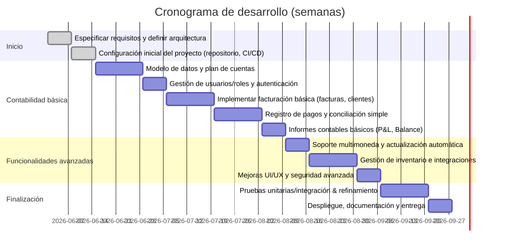

# Resumen Ejecutivo  
El objetivo es desarrollar un **clon realista de QuickBooks**, cubriendo contabilidad básica (facturación, cuentas por cobrar/pagar, conciliación, etc.) y funciones avanzadas (multimoneda, inventario, reportes, integraciones). Se propone un enfoque modular: primero implementar las **funcionalidades mínimas esenciales** para un sistema contable operativo, luego las **funciones avanzadas** de valor agregado. El análisis de fuentes oficiales y proyectos open source muestra que QuickBooks incluye creación de facturas, recibos, presupuestos, seguimiento de gastos, conciliación bancaria y gestión de inventarios integrados con ventas (Amazon, Shopify). Los datos se almacenan en una estructura de **asientos contables de partida doble** con reportes financieros (Pérdidas y Ganancias, Balance) calculados automáticamente. El sistema debe ser multiusuario (roles/permiso personalizado), soportar **multimoneda** con actualización de cotizaciones automáticas, y permitir integraciones comunes (bancos, pasarelas de pago, e-commerce). Para planificar el desarrollo se establecen tareas ordenadas (configuración, facturación, conciliación, reportes, etc.), cada una con criterios de aceptación claros y pruebas unitarias/funcionales asociadas. A continuación se detalla el análisis de funcionalidades, comparativo de alcances **mínimos vs. avanzados**, requisitos técnicos sugeridos, ejemplos de bibliotecas open source relevantes y consideraciones legales. Al final se incluye un *prompt* detallado para guiar a un modelo de código (Codex/Claude) a revisar e implementar las funciones faltantes, junto con un cronograma estimado (en semanas) y diagramas Mermaid de alto nivel (ER y Gantt).

## Funcionalidades esenciales de QuickBooks  
Con base en la documentación oficial y casos de uso de QuickBooks, un sistema contable completo debería ofrecer al menos lo siguiente:  

- **Facturación y Clientes/Proveedores:** Crear y enviar facturas y cotizaciones personalizadas, recibos de pago, y registrar pagos. Soportar facturas periódicas y recordatorios automáticos. Gestionar listas de clientes y proveedores con la posibilidad de editar descuentos, condiciones y cuentas asociadas.  
- **Cuentas por Cobrar/Pagar:** Registrar facturas de clientes (CXC) y facturas de proveedores/gastos (CXP), aplicar pagos, y agrupar cuentas por cliente/proveedor. QuickBooks recomienda mantener cuentas únicas de CxC y CxP en el plan contable, aunque permite configuraciones avanzadas (clientes secundarios, ubicaciones).  
- **Conciliación Bancaria:** Conectar cuentas bancarias (API o importación OFX/QFX) para importar movimientos y reconciliar automáticamente con ingresos/gastos registrados. Calcular diferencias por tipo de cambio y actualizar saldos.  
- **Asientos Contables y Plan de Cuentas:** Registro automático en partida doble de todas las transacciones (facturas, pagos, gastos, etc.). Gestión del plan de cuentas (crear/editar cuentas), registro de asientos manuales y cierre de ejercicio. Informes básicos (libro diario, mayores).  
- **Impuestos y Reportes Financieros:** Cálculo automático de impuestos (IVA/IGV), generación de modelos fiscales predefinidos (e.g. declaración de IVA en España) y reportes estándar: Balance, Pérdidas y Ganancias, Flujo de Caja, así como reportes analíticos de antigüedad de saldos.  
- **Multi-moneda:** Soporte de transacciones en varias monedas. Se registra cada operación en moneda local y en la moneda del sistema, con ajuste automático de ganancias/pérdidas cambiarias al conciliar.  
- **Usuarios y Roles:** Plataforma multiusuario con permisos configurables. QuickBooks Online permite crear roles personalizados con niveles de acceso (Ver, Crear, Editar, Eliminar) sobre módulos (clientes, inventario, contabilidad, etc.).  
- **Seguridad y Acceso Remoto:** Datos en la nube con cifrado (seguridad bancaria). Acceso vía web desde cualquier dispositivo, respaldos automáticos. Opciones de autenticación fuerte (contraseñas seguras, 2FA).  
- **Integraciones Comunes:** Conexión con pasarelas de pago (Stripe, PayPal), plataformas de e-commerce (Shopify, WooCommerce, Amazon) y APIs bancarias. QuickBooks se integra también con aplicaciones de terceros para reportes o flujo de trabajo.  

Estas funcionalidades forman la base para el MVP (*mínimo producto viable*). A partir de ellas, se identifican características “avanzadas” que pueden ofrecer valor adicional en etapas posteriores (ver tabla comparativa).

## Tabla de funcionalidades (mínimas vs avanzadas)  

| **Funcionalidad**        | **Nivel Mínimo (Esencial)**                                | **Nivel Avanzado (Opcional)**                               |
|--------------------------|-----------------------------------------------------------|------------------------------------------------------------|
| **Facturación**          | Crear/editar facturas, recibos y cotizaciones; envío por correo; facturas recurrentes simples.       | Facturación por lotes; facturas electrónicas (eInvoice); recordatorios automáticos avanzados; desglose de impuestos múltiples. |
| **Clientes/Proveedores** | CRUD de clientes y proveedores, vista de historial de saldos.                                   | Clientes/proveedores secundarios/grupos; seguimiento por ubicaciones/clases; gestión de contratos y anticipos. |
| **Cuentas x Cobrar/Pagar** | Registro de facturas CxC y CxP, aplicación de pagos; informe de antigüedad.                       | Agrupación avanzada (vía clientes principales o ubicaciones); pagos parciales y multimoneda. |
| **Conciliación Bancaria** | Importación de movimientos bancarios (OFX/QFX); emparejamiento básico; ajuste de diferencias.      | Reglas automáticas de categoría; lectura directa de APIs bancarias; conciliación por lotes; gestión de discrepancias. |
| **Plan de Cuentas / Partida Doble** | Plan de cuentas configurable; generación automática de asientos (doble) de facturas y pagos; asientos manuales básicos. | Cuentas múltiples por entidad; asientos de ajuste automático (amortizaciones, provisiones); cierre contable y bloqueo de periodos. |
| **Reportes Financieros** | Balance, Pérdidas y Ganancias, flujo de caja simple; informe de impuestos (IVA/IGV); reporte de antigüedad de cuentas por cobrar/pagar. | Reportes personalizados; analíticas (por proyecto, sucursal, etc.); KPI financieros, pronóstico de flujo de caja. |
| **Inventario**           | (Opcional inicial) Catálogo de productos/servicios con stock; actualización de inventario por ventas/compras. | Valoración automática (PEPS/FIFO); múltiples almacenes; remanente por lote/serie; integración con punto de venta (POS). |
| **Multi-moneda**         | Soporte de moneda extranjera al registrar transacciones; conversión de moneda básica.             | Cálculo automático de tipos (API de cotización); gestión de pérdidas/ganancias cambiarias en conciliación; múltiples monedas en reportes. |
| **Usuarios/Roles**       | Usuario administrador y contable con permisos globales; auditoría básica de accesos.             | Roles personalizables detallados (ventas, compras, contabilidad); auditoría completa de cambios; SSO corporativo. |
| **Integraciones**        | Exportación/importación CSV/Excel; APIs simples para datos maestros.                            | Integración con CRM, e-commerce (WooCommerce, Shopify, Amazon); conexión a pasarelas de pago; API REST completa para aplicaciones externas. |

## Requisitos técnicos sugeridos  

- **Arquitectura:** Aplicación web basada en arquitectura de 3 capas. Servidor backend de negocio (por ejemplo, REST API en Python/Django o Node.js/Nest), base de datos relacional (PostgreSQL o MySQL) y frontend web (React, Vue o similar). Autenticación segura (JWT o sesiones con HTTPS). Opcional: microservicios para escalabilidad (e.g. servicio contable separado, servicio de reportes).  
- **Stack recomendado:** Lenguaje de alto nivel con soporte contable: Python (Django + Django Ledger o Flask con librerías de contabilidad), o Node.js (Express/Nest con librerías double-entry). Frontend moderno (React/Vue/Angular). Docker para despliegue. Ubicuidad de PostgreSQL para fiabilidad transaccional.  
- **Bases de datos:** Relacional es esencial (requiere transacciones ACID). Diseñar tablas para `Companies`, `Users`, `Accounts` (plan de cuentas), `JournalEntries` y `JournalLines` (partida doble), `Customers`, `Vendors`, `Invoices`, `InvoiceLines`, `Bills`, `BillLines`, `Payments`, `Products`, `Inventory`, etc. (ver diagrama ER ejemplo abajo). Índices en campos clave (números de cuenta, IDs de cliente). Considerar Multi-tenant (empresa) si se necesita multicompañía.  
- **Seguridad:** Cifrado en tránsito (TLS/HTTPS) y en reposo (si se almacena información sensible). Políticas OWASP: validación de entradas, protección contra inyección, XSS, CSRF. Gestión de contraseñas (hashing bcrypt/argon2). Autorización basada en roles. Registros de auditoría de transacciones críticas.  
- **Escalabilidad y despliegue:** Diseñar con separación de tareas y posibilidad de escalar horizontalmente (balanceo de carga del API, replicación de DB lectura). Uso de colas (ej. RabbitMQ) para procesos pesados (reportes, conciliación masiva). Contenedores (Docker/Kubernetes) para portabilidad. Caching moderado (Redis) para reportes de datos no críticos.  
- **APIs:** Exponer una API REST (o GraphQL) que permita operar con entes contables: endpoints para clientes, facturas, pagos, reportes financieros, etc. Autenticación OAuth o token. Si se integra con terceros, usar estándares (OFX/QFX para bancos, API de correos para envío de facturas).  
- **Libs y proyectos open source relevantes:** Además de frameworks web, existen librerías contables útiles:  
  - **Django Ledger:** motor de partida doble para Django con GUI de informes y factura/bill/PO integrados.  
  - **Python Accounting:** librería Python para contabilidad doble (IFRS/GAAP) con generación de reportes financieros.  
  - **FacturaScripts:** software libre en PHP especializado en facturación y contabilidad con extensiones fiscales (España, LatAm).  
  - **Odoo Contabilidad:** ERP open-source en Python con módulo contable completo (multimoneda, conciliación, presupuestos).  
  - **GnuCash, Ledger, ERPNext:** otros proyectos conocidos de contabilidad; p.ej. LedgerSMB (Perl), ERPNext (Frappe/ Python).  
  - **Bibliotecas de integración:** Para pasarelas de pago (Stripe SDK), generación PDF (wkhtmltopdf o jsPDF), autenticación (OAuth2 libs), etc.  
  - (Fuentes: facturascripts.com, django-ledger.readthedocs, python-accounting GitHub).  

- **Licencias y riesgos legales:** QuickBooks es marca registrada de Intuit, por lo que no usar nombre ni logos. Evitar copiar textualmente interfaces patentadas. Adoptar licencias compatibles si se reutiliza código abierto (p.ej. Django Ledger es AGPL (cheque), FacturaScripts es GPL o MIT). Verificar licencias de librerías (evitar incompatibilidades GPL+otros). Considerar normativas fiscales (p.ej. SII en España) si se añaden funciones específicas. Proteger la propiedad intelectual propia del código.  

## Plan de trabajo estimado  
Se propone el siguiente cronograma (en semanas), con entregables parciales y prioridades:



- **Semana 1-2:** Montar entorno, diseñar DB (tabla `Accounts`, `Entries`, `Customers`, etc.) y flujos de autenticación.  
- **Semana 3-5:** Implementar módulos críticos: entidades contables (Plan de cuentas, Asientos), modelos Cliente/Proveedor, facturas (ventas) y pagos. Cada módulo acompañado de pruebas unitarias e integración que garanticen el flujo contable.  
- **Semana 6-7:** Añadir conciliación bancaria (importación de extractos), reporte de balance y PyG.  
- **Semana 8-9:** Funciones avanzadas: multi-moneda (tasas en API), gestión de inventario simple, integración básica con tiendas/e-commerce.  
- **Semana 10-11:** Realizar pruebas end-to-end, optimizar rendimiento y ajustes de seguridad (TLS, encriptación de datos sensibles). Documentación de instalación y uso.  

Cada tarea tendrá criterios de aceptación claros (p.ej. “al crear una factura se debe generar el asiento contable correspondiente y actualizar cuentas CxC/CxP”). Se entregarán pruebas unitarias/integración para cada funcionalidad (cobertura mínima del 80%).  

## Diagrama de datos (ER simplificado)  
```mermaid
erDiagram
    COMPANY ||--o{ USER
    COMPANY ||--o{ ACCOUNT
    ACCOUNT ||--o{ JOURNAL_ENTRY
    JOURNAL_ENTRY ||--|{ JOURNAL_LINE
    CUSTOMER ||--o{ INVOICE
    INVOICE ||--|{ INVOICE_LINE
    VENDOR ||--o{ BILL
    BILL ||--|{ BILL_LINE
    ACCOUNT ||--o{ PAYMENT
    INVOICE ||--o{ PAYMENT
    BILL ||--o{ PAYMENT
    PRODUCT ||--o{ INVOICE_LINE
    PRODUCT ||--o{ BILL_LINE
    COMPANY }o--|| REPORT
```

Este diagrama ER muestra las relaciones clave: una **Compañía** tiene varios usuarios y cuentas contables; las transacciones (facturas/bills/pagos) generan **Journal Entries** en partidas dobles; los **Clientes** generan facturas y los **Proveedores** generan bills, que se liquidan con pagos registrados sobre cuentas. Los **Productos** (inventario) pueden incluirse en facturas o facturas de proveedor, actualizando el stock.

## Prompt para modelo de código (Codex/Claude)  

> **Objetivos:** Revisar el código existente del proyecto (repositorio actual no provisto) y **implementar** las funcionalidades contables faltantes para que el sistema opere como un QuickBooks. Se deben cubrir al menos las funciones mínimas listadas en este informe (ver sección de funcionalidades), con arquitectura escalable, código limpio y pruebas automáticas.  
>
> **Contexto del repositorio:** Se asume un proyecto web con frontend y backend separados (por ejemplo, un API REST en Python/Django o Node.js y UI en React). Si aún no existe un repositorio, indique en el prompt que se trabaje partiendo de un esqueleto genérico.  
>
> **Estructura esperada:**  
> - Backend: archivos de modelo (por ejemplo `models.py` o `models/Account.js`), controladores/servicios para facturas, clientes, conciliación, etc.  
> - Frontend: componentes para formularios de factura, listado de clientes/proveedores, vistas de reportes.  
> - Tests: archivos de prueba (ej. `test_invoice.py`, `invoice.spec.ts`) para cada módulo crítico.  
> - Otras configuraciones: rutas API, migraciones de base de datos.  
>
> **Criterios de aceptación:** Al finalizar, el código debe:  
> 1. Crear/editar facturas y facturas de proveedor correctamente, generando automáticamente los asientos contables correspondientes (doble entrada).  
> 2. Permitir registrar pagos asociados a facturas/bills, actualizando saldos de cuentas por cobrar/pagar.  
> 3. Gestionar clientes y proveedores con datos básicos (nombre, identificación, términos de pago).  
> 4. Importar/examinar movimientos bancarios y conciliar con transacciones registradas, informando diferencias.  
> 5. Calcular y mostrar reportes financieros básicos (Balance, Pérdidas/Ganancias).  
> 6. Soportar transacciones en dos monedas (e.g. USD/EUR) con cálculo de diferencias cambiarias simples.  
> 7. La seguridad: solo usuarios autenticados pueden acceder, con roles mínimo (`admin`, `contable`).  
> 8. El código debe incluir pruebas unitarias (para lógicas de asientos, facturación) y pruebas de integración (por ejemplo, simulando flujo de factura->pago->reporte).  
> 9. Documentación mínima en comentarios (docstrings o JsDoc) explicando cada método/servicio.  
>
> **Convenciones de código:** Usar estilo consistente: si es Python, seguir PEP8 (indentación 4 espacios, nombrado snake_case); si es JavaScript/TypeScript, seguir ESLint estándar (CamelCase para clases, camelCase para variables). Incluir comentarios cuando sea útil. Nombres claros en español o inglés (ajustado al resto del código).  
> 
> **Límites de cambios:** No reescribir por completo módulos ya implementados a menos que sean errores críticos. Enfocarse en **añadir o extender** funcionalidad en los módulos faltantes: por ejemplo, crear nuevos modelos (Entidad `Factura`, `Proveedor`, etc.), nuevos endpoints y lógica. No eliminar funcionalidades existentes.  
>
> **Instrucciones específicas (por funcionalidad):**  
> - **Facturación:** “Implementa la entidad `Factura` con líneas de factura. Al crear una factura, generar automáticamente dos asientos contables: debito a `Cuenta por Cobrar` y crédito a `Ingresos`. Actualizar saldo del cliente.”.  
> - **Clientes/Proveedores:** “Crea modelos/colecciones `Cliente` y `Proveedor` con CRUD. Asocia cada factura con un Cliente y cada bill con un Proveedor. Agrega validaciones básicas (nombre requerido, RUC/ID opcional).”  
> - **Pagos:** “Agregar modelo `Pago` vinculado a facturas o bills. Al registrar un pago, generar asiento contable (debitar `Caja/Banco`, acreditar `CxC` o `CxP` correspondiente). Validar que el monto no exceda saldo pendiente.”  
> - **Plan de Cuentas:** “Configura un plan contable inicial (cuentas de activo, pasivo, ingresos y gastos). Permite agregar nuevas cuentas desde la interfaz administrativa. Validar sumas patrimoniales.”  
> - **Conciliación Bancaria:** “Crear funcionalidad de importar movimientos bancarios. Desarrollar vista donde se muestren transacciones bancarias pendientes y facturas/pagos conciliables. Al conciliar, generar asiento de ajuste si hay diferencia.”  
> - **Reportes:** “Genera endpoints para reportes contables: Balance General y Estado de Resultados, basados en la sumatoria de asientos en un periodo dado. Asegura coherencia del patrimonio (activos = pasivos + patrimonio).”  
> - **Multimoneda (avanzado):** “Permitir asignar moneda a facturas y pagos. Al finalizar mes, generar asiento automático de ajuste por variación de tipo de cambio.”  
> - **Integraciones (opcional):** “Si es posible, crea stubs para API de pago (por ej. endpoint `POST /api/paypal-webhook`) y/o sincronización de productos con Shopify.”  
>
> **Plan de trabajo con diagrama:** Finalmente, solicita que el modelo proponga un plan de trabajo desglosado en tareas concretas con estimaciones de tiempo por tarea (en semanas) y un **diagrama mermaid de alto nivel**. Por ejemplo, se le puede pedir que incluya un gráfico de flujo o ER con entidades principales. Asegúrate de indicar que el diagrama sea simplificado y señalar explícitamente las entidades (p.ej. `Cliente`, `Factura`, `Asiento`) y relaciones cardinales en el esquema mermaid.  

Las instrucciones anteriores deben ser incluidas en el **prompt** enviado al modelo de código, de modo que este genere el código requerido y la planificación solicitada.

